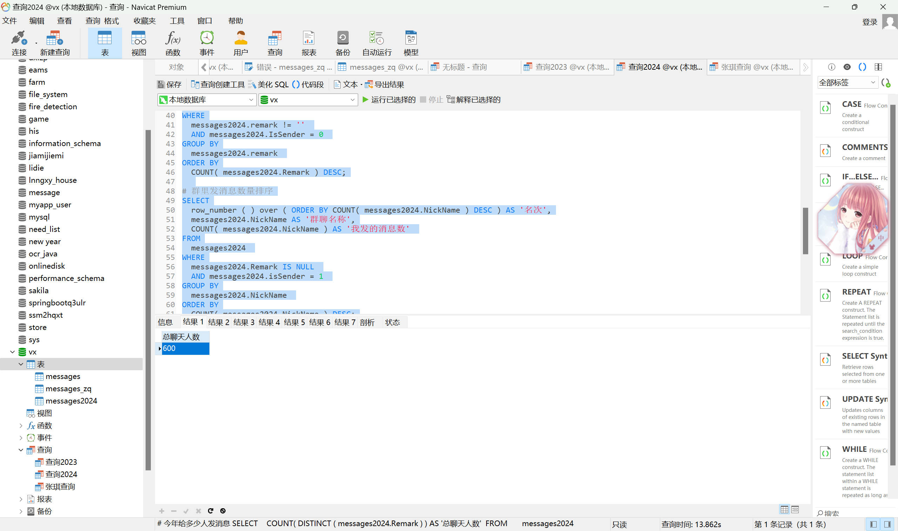

## 微信年度总结

### 如何生成一份优秀的微信年度总结，就像...


本年聊天词云


每月消息统计


周内消息统计


按月统计


每日消息分布


榜单统计

全过程录屏准备中，将录制并上传至 Bilibili 中。

### 准备工作

#### 1. 微信消息导出

微信消息导出使用 [留痕 | MemoTrace](https://memotrace.cn/)

教程： [Deploy | MemoTrace](https://memotrace.cn/doc/posts/deploy/)


按流程获取信息后，最后点击`数据`->`导出聊天记录（全部）`->`CSV`导出

#### 2. 聊天记录的处理

由于上图中导出的聊天记录中为全部聊天记录，所以我们需要将 2023 年以前的所有聊天记录进行删除。

由于导出的聊天记录文件可能较大（如我的 337 万行约 622MB），所以我们可以使用文本编辑器如`VScode`等对导出的`message.csv`进行修改

我们可以在`message.csv`中搜索`2024-01-01`来寻找 2024 年一月一日所发送的第一条消息，然后将此前的消息全部删除，需要注意的是，表格第一行

> localId,TalkerId,Type,SubType,IsSender,CreateTime,Status,StrContent,StrTime,Remark,NickName,Sender

不能删除。


### Python 代码部分

本部分需要一定的`python`语言基础，主要作用为生成词云图，统计数据等。此部分如果想偷懒，可以选择直接执行`main.ipynb`文件的所有单元格即可。

#### 1. 库的准备

本部分需要使用到`pandas`，`matplotlib`，`wordcloud`等库，使用`pip`进行安装。代码部分如下所示。

```python
import numpy as np
import pandas as pd
import seaborn as sns
import matplotlib.pyplot as plt
import matplotlib
import chardet
import jieba

from PIL import Image
from collections import Counter
from wordcloud import WordCloud, STOPWORDS,ImageColorGenerator #词云库
from matplotlib.font_manager import *#如果想在图上显示中文，需导入这个包
from matplotlib import cm
# 设置中文字体
plt.rcParams['font.sans-serif']=['SimHei']
plt.rcParams['axes.unicode_minus'] = False
# 设置上步中导出的csv文件路径
path = 'messages.csv'
```

#### 2. 词云图的生成

```Python
df = pd.read_csv(path, sep=',')
# df.to_excel('messages.xls')
# 使用指定的中文字体路径创建词云对象
font_path = 'C:/Windows/Fonts/msyh.ttc'  # 假设你已经下载了微软雅黑字体并知道其路径

# 筛选满足 Type == 1 且 IsSender == 1 的 StrContent
bobo_content = df[(df['Type'] == 1) & (df['IsSender'] == 1)]['StrContent']

# 指定保存的txt文件路径和名称
output_file_path = 'bobo_content.txt'

# 将筛选后的内容保存到txt文件中
bobo_content.to_csv(output_file_path, index=False, header=False, sep='\t')

with open('bobo_content.txt', 'r', encoding='utf-8') as file:
   bobo_text = file.read()

bobo_text = bobo_text.replace('[可怜]', '')
# 加载中文停用词
stopwords_path = "stopwords_cn.txt"
with open(stopwords_path, 'r', encoding='utf-8') as f:
   stopwords_list = [line.strip() for line in f.readlines()]

# 将筛选后的内容分词
bobo_words = jieba.cut(bobo_text)

# 定义词云形状
mask_image_path = "heart_shape.png" #加载词云图的形状
mask_image = np.array(Image.open(mask_image_path))
img_colors = ImageColorGenerator(mask_image)

# 定义词云参数
wordcloud = WordCloud(
   font_path=font_path,
   min_font_size = 4,
   max_font_size = 100,
   margin = 2,
   scale = 2,
   random_state = 42,
   width=800,
   height=800,
   background_color='white',
   stopwords=stopwords_list,
   mask=mask_image,  # 使用自定义的图片作为词云的形状
   colormap='pink'   # 使用粉色调色板
).generate(' '.join([word for word in bobo_words if word not in stopwords_list]))

wordcloud.recolor(color_func=img_colors)

# 保存生成的词云图片
output_image_path = "bobo_wordcloud.png"
wordcloud.to_file(output_image_path)

# 显示词云
plt.figure(figsize=(40, 40))
plt.imshow(wordcloud, interpolation='bilinear')
plt.axis("off")
plt.show()
```

需要注意的是，此处使用了两个文件`stopwords_cn.txt`和`heart_shape.png`，前者为中文停用词，后者为词云图的形状。

此处将生成词云图并将图片保存为`bobo_wordcloud.png`。

#### 3. 每月消息统计图

```python
df2 = pd.read_csv(path, sep=',', usecols=[4,7,8])
df2['month'] = pd.to_datetime(df2['StrTime']).dt.month

month_counts = df2['month'].value_counts().sort_index()

scaled_sizes = month_counts * 0.08

# 绘制散点图
plt.figure(facecolor='white')

plt.title('图2 每月消息统计',fontsize=22)

plt.xlabel('月份',fontsize=20)
plt.ylabel('消息数量',fontsize=20)
plt.xticks(range(1, 13), fontname='Times New Roman',fontsize=15)
plt.yticks(fontname='Times New Roman',fontsize=15)

plt.scatter(month_counts.index, month_counts.values, color='#80BCBD', marker='o',s=scaled_sizes)

plt.grid(True, linestyle='solid', linewidth=1, color='lightgrey',axis='y')

fig = plt.gcf()
fig.set_size_inches(15,8)
fig.savefig('chat_month.png',dpi=100)
plt.show()
```

此处将生成的每月消息数量统计图保存为`chat_month.png`。

#### 4. 每月发送/接收消息数量

```python
df2['month_bobo'] = pd.to_datetime(df2[df2['IsSender'] == 1]['StrTime']).dt.month
df2['month_pupu'] = pd.to_datetime(df2[df2['IsSender'] == 0]['StrTime']).dt.month

labels = ['接收', '发送']
colors = ['#FFC0D9', '#8ACDD7']

month_counts_bobo = df2['month_bobo'].value_counts().sort_index()
month_counts_pupu = df2['month_pupu'].value_counts().sort_index()

# 找到PUPU和BOBO每个月的最大值和对应的月份
max_bobo = month_counts_bobo.max()
max_month_bobo = month_counts_bobo.idxmax()

max_pupu = month_counts_pupu.max()
max_month_pupu = month_counts_pupu.idxmax()

month_counts_pupu.plot(kind='line', marker='o', label='接收',color='#FFC0D9')
month_counts_bobo.plot(kind='line', marker='o', label='发送',color='#8ACDD7')

# 在最高点上添加标签
plt.annotate(f'Max: {max_pupu}', xy=(max_month_pupu, max_pupu), xytext=(max_month_pupu + 0.5, max_pupu + 10),
            arrowprops=dict(facecolor='black', arrowstyle='->'),
            fontsize=18,fontname='Times New Roman')

plt.annotate(f'Max: {max_bobo}', xy=(max_month_bobo, max_bobo), xytext=(max_month_bobo + 0.4, max_bobo + 10),
            arrowprops=dict(facecolor='black', arrowstyle='->'),
            fontsize=18,fontname='Times New Roman')

plt.title('图3: 每月发送/接收消息数量',fontsize=22)

plt.xlabel('月份', fontsize=20)
plt.ylabel('消息数量',fontsize=20)
plt.xticks(range(1, 13), fontname='Times New Roman',fontsize=15)
plt.yticks(fontname='Times New Roman',fontsize=15)

plt.grid(True, linestyle='solid', linewidth=0.5, color='lightgrey')

font_prop = FontProperties(family='SimHei')
plt.legend(labels, loc="best",prop=font_prop)

plt.tight_layout()  # 优化布局，确保标签和标题不重叠

fig = plt.gcf()
fig.set_size_inches(15,8)
fig.savefig('chat_plot.png',dpi=100)
plt.show()
```

此处将生成的每月发送/接收消息数量统计图保存为`chat_plot.png`。

#### 5. 发送/接受消息比

```python
value_counts = df2['IsSender'].value_counts()

# 计算百分比
percentages = 100. * value_counts / value_counts.sum()

# 创建饼图
labels = ['接收', '发送']
colors = ['#FFC0D9', '#8ACDD7']
explode = (0.1, 0)  # 突出显示第一个切片

plt.figure(figsize=(8, 8))

# 定义格式化函数，用于在饼图内部显示数据
def func(pct, allvals):
   absolute = int(pct/100.*np.sum(allvals))
   return f"{pct:.1f}%\n({absolute:d})"

plt.pie(value_counts, explode=explode, labels=labels, colors=colors,
      autopct=lambda pct: func(pct, value_counts), shadow=True, startangle=80, textprops={'style':'italic' , 'fontsize': 18})

plt.title('Figure 3: Distribution of Messages: PUPU vs. BOBO', fontname='Times New Roman',fontsize=22)
font_prop = FontProperties(family='Times New Roman')
plt.legend(labels, loc="best",prop=font_prop)
plt.axis('equal')  # 使饼图保持圆形

fig = plt.gcf()
fig.set_size_inches(15,8)
fig.savefig('chat_pie',dpi=100)
plt.show()
```

此处将生成的发送/接受消息比统计图保存为`chat_pie.png`。

#### 6. 周内消息分布统计

```python
dates = pd.to_datetime(df2['StrTime'])
weekdays = dates.dt.day_name()

weekday_counts = weekdays.value_counts()

# 绘制饼图

colors = ['#FF90BC', '#FFC0D9', '#F9F9E0', '#8ACDD7', '#EEE7DA', '#88AB8E', '#AFC8AD']
explode = (0.1, 0, 0, 0, 0, 0, 0)  # 突出显示第一个切片
plt.figure(figsize=(8, 8))

plt.pie(weekday_counts, explode=explode, labels=weekday_counts.index, colors=colors, autopct='%1.1f%%', shadow=True, startangle=90,textprops={'fontsize': 18})
plt.title('图4 周内消息分布',fontsize=22)
font_prop = FontProperties(family='Times New Roman')
plt.legend(labels=weekday_counts.index, loc="best",prop=font_prop)
plt.axis('equal')  # 使饼图保持圆形

fig = plt.gcf()
fig.set_size_inches(15,8)
fig.savefig('chat_pie_2',dpi=100)
plt.show()
```

此处将生成的周内消息分布统计图保存为`chat_pie_2.png`。

#### 7. 全年每日消息详情

```python
# 将 'Date' 列转换为 datetime 类型
df2['Date'] = pd.to_datetime(df2['StrTime'])

df2.set_index('Date', inplace=True)

# 创建一个包含每月统计数据的字典
monthly_counts = {}

# 对每个月的 DataFrame 进行处理
for month in range(1, 13):
   month_str = f'2024-{month:02d}'
   month_df = df2.loc[month_str]

   # 按每天统计数量
   daily_count = month_df.resample('D').size()

   # 存储在字典中
   monthly_counts[month_str] = daily_count

# 绘制五条折线图
plt.figure(figsize=(12, 8))

# 添加标题和标签
# labels = ['2023-08', '2023-09', '2023-10', '2023-11', '2023-12']
labels = [f'2024-{month:02d}' for month in range(1, 13)]
# 随机生成颜色列表
import random
colors = ['#%06x' % random.randint(0, 0xFFFFFF) for _ in range(len(monthly_counts))]
# colors = ['#88AB8E', '#FF9843', '#3468C0', '#D63484', '#402B3A']

for idx, (month, count_data) in enumerate(monthly_counts.items()):
   plt.plot(count_data.index.day, count_data.values, marker='o', linestyle='-', color=colors[idx], label=month)

   # 找到最大值和对应的索引
   max_value = count_data.max()
   max_day = count_data.idxmax().day  # 获取最大值对应的日期

   # 在图上标注最大值
   plt.annotate(f'Max: {max_value}', xy=(max_day, max_value), xytext=(max_day + 1.2, max_value + 1),
               arrowprops=dict(facecolor='black', arrowstyle='->'),
               fontsize=18, fontname='Times New Roman')

plt.title('Number of messages sent per month in 2024', fontname='Times New Roman',fontsize=22)
plt.xlabel('Day', fontname='Times New Roman',fontsize=20)
plt.ylabel('Messages', fontname='Times New Roman',fontsize=20)
plt.xticks(range(1, 32),fontname='Times New Roman',fontsize=15)  # 设置x轴标签
plt.yticks(fontname='Times New Roman',fontsize=15)
font_prop = FontProperties(family='Times New Roman')
plt.legend(labels, loc="best",prop=font_prop)
plt.grid(True, linestyle='solid', linewidth=0.5, color='lightgrey')  # 添加网格线

plt.tight_layout()

fig = plt.gcf()
fig.set_size_inches(15,8)
fig.savefig('chat_plot_2.png',dpi=100)
plt.show()
```

此处将生成的全年每日消息详情统计图保存为`chat_plot_2.png`。

#### 8. 聊天月计数热图

```python
plt.rcParams['font.sans-serif']=['SimHei']
plt.rcParams['axes.unicode_minus'] = False
df2['Date'] = pd.to_datetime(df2['StrTime'])
df2['Month'] = df2['Date'].dt.month  # 提取月份


# 使用pivot_table创建矩阵，按月份和日期
heatmap_data = df2.pivot_table(index=df2['Date'].dt.day, columns='Month', values='StrTime', aggfunc='count')

# 使用seaborn绘制热力图
sns.heatmap(heatmap_data, cmap="GnBu", linewidths=0.5, linecolor='gray')

plt.title('图6: 聊天月计数热图',fontsize=22)
plt.xlabel('月', fontsize=20)
plt.ylabel('日', fontsize=20)
plt.xticks(fontname='Times New Roman',fontsize=15)  # 设置x轴标签
plt.yticks(fontname='Times New Roman',fontsize=15)
plt.tight_layout()

fig = plt.gcf()
fig.set_size_inches(15,8)
fig.savefig('heatmap_2.png',dpi=100)

plt.show()
```

此处将生成的聊天月计数热图统计图保存为`heatmap_2.png`。

#### 9. 每日消息分布

```python
# sns.set_style('darkgrid')#设置图片为深色背景且有网格线
# sns.set_context("talk")
plt.rcParams['font.sans-serif']=['SimHei']
plt.rcParams['axes.unicode_minus'] = False

sns.histplot(df2['hour'],bins=24,kde=False, color='lightcoral')

plt.title('图5: 每日消息分布',fontsize=18)
plt.xlabel('时间 (时)',fontsize=18)
plt.ylabel('消息数量',fontsize=18)

plt.xticks(np.arange(0, 25, 1.0),fontsize=15)
plt.yticks(fontsize=15)

fig = plt.gcf()
fig.set_size_inches(15,8)
fig.savefig('chat_time.png',dpi=100)
plt.show()
```

此处将生成的每日消息分布统计图保存为`chat_time.png`。

### SQL 代码部分

由于导出的数据量较大，一年的微信消息可能达到几十万条，因此将数据导入到 MySQL 中进行分析。此部分需要一定的 SQL 基础与 Navicat 相应的应用（也可以使用其他的数据库连接软件）。

#### 1. 导入过程

导入时我们使用`Navicat`软件进行,如图。

选择修改后的`message.csv`文件进行导入。
需要注意的是，我们需要将`StrContent`列的数据类型修改为`text`类型。因为部分的消息内容过长，默认的`varchar`类型无法存储。


#### 2. 数据查询

点击 Navicat 中的查询即可进行 SQL 查询，查询的语句如下所示（与`查询.sql`文件相同）。

```sql
# 今年给多少人发消息
SELECT
	COUNT( DISTINCT ( messages.Remark ) ) AS '总聊天人数'
FROM
	messages;# 聊天信息数量排序
SELECT
	row_number ( ) over ( ORDER BY COUNT( messages.Remark ) DESC ) AS '名次',
	messages.Remark AS '好友昵称',
	COUNT( messages.Remark ) AS '聊天条数'
FROM
	messages
WHERE
	messages.remark != ''
GROUP BY
	messages.remark
ORDER BY
	COUNT( messages.Remark ) DESC;

# 我发的消息最多
SELECT
	row_number ( ) over ( ORDER BY COUNT( messages.Remark ) DESC ) AS '名次',
	messages.Remark AS '昵称',
	COUNT( messages.Remark ) AS '我发的条数'
FROM
	messages
WHERE
	messages.remark != ''
	AND messages.IsSender = 1
GROUP BY
	messages.remark
ORDER BY
	COUNT( messages.Remark ) DESC;

SELECT
	row_number ( ) over ( ORDER BY COUNT( messages.Remark ) DESC ) AS '名次',
	messages.Remark AS '昵称',
	COUNT( messages.Remark ) AS '对方发的条数'
FROM
	messages
WHERE
	messages.remark != ''
	AND messages.IsSender = 0
GROUP BY
	messages.remark
ORDER BY
	COUNT( messages.Remark ) DESC;

# 群里发消息数量排序
SELECT
	row_number ( ) over ( ORDER BY COUNT( messages.NickName ) DESC ) AS '名次',
	messages.NickName AS '群聊名称',
	COUNT( messages.NickName ) AS '我发的消息数'
FROM
	messages
WHERE
	messages.Remark IS NULL
	AND messages.isSender = 1
GROUP BY
	messages.NickName
ORDER BY
	COUNT( messages.NickName ) DESC;

# 群里收消息数量排序
SELECT
	row_number ( ) over ( ORDER BY COUNT( messages.NickName ) DESC ) AS '名次',
	messages.NickName AS '群聊名称',
	COUNT( messages.NickName ) AS '我收到的消息数'
FROM
	messages
WHERE
	messages.Remark IS NULL
	AND messages.isSender = 0
GROUP BY
	messages.NickName
ORDER BY
	COUNT( messages.NickName ) DESC;


SELECT
	count( * ) AS '今年消息总数'
FROM
	messages;
```

需要注意的是，如果你在导入时重命名了表名，那么在查询时需要将原表名`messages`修改为你重命名的表名。
运行上述 SQL 查询你将得到如下图的结果。

我们可以对查询的结果进行截图或导出为 excel 文件进行进一步的分析。


联系作者：绿泡泡`zjxyyds0307`